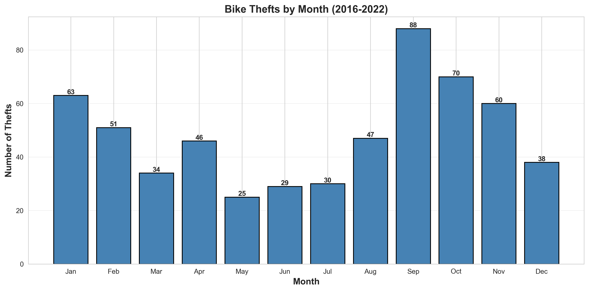
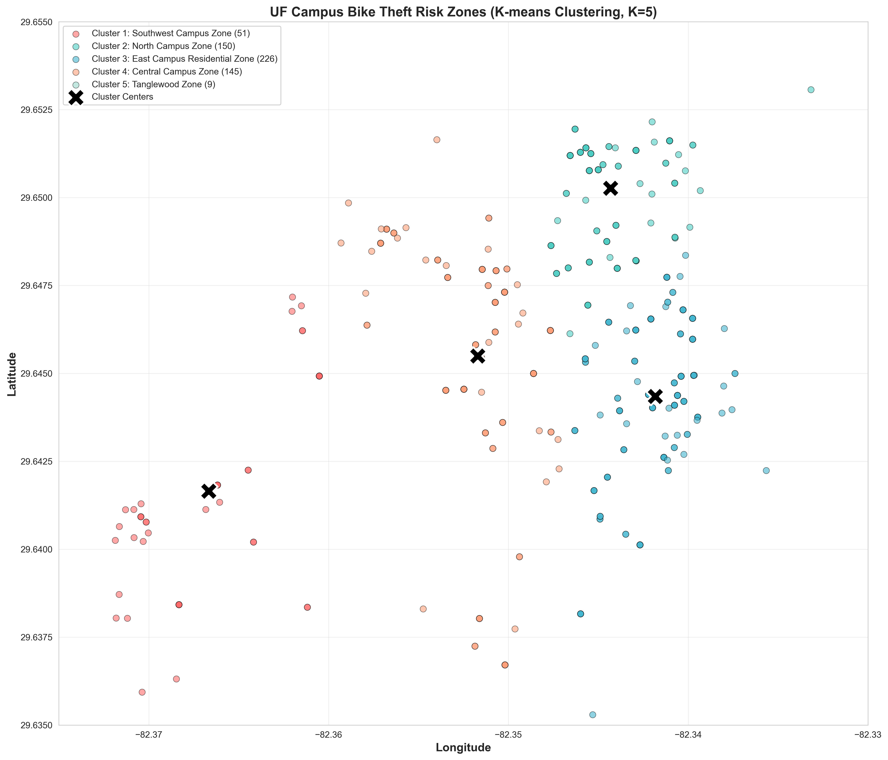
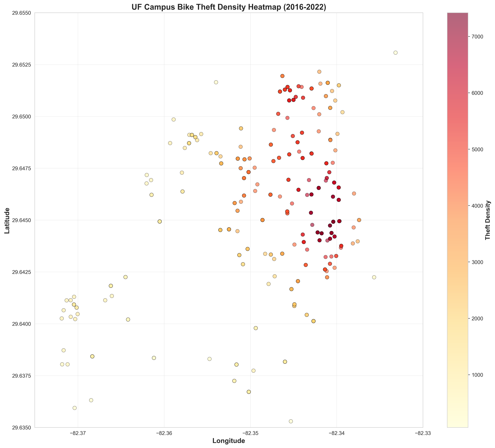

# UF Campus Bike Theft Pattern Analysis (2016-2022)

An analysis of 581 on campus bike theft incidents from UF Crime logs using geospatial clustering and temporal pattern analysis to identify which areas of campus and which months of the year are at the highest risk.

[](https://www.python.org/)
[](https://pandas.pydata.org/)
[](https://scikit-learn.org/)
[](https://www.sqlite.org/)

## Project Overview

This project analyzes bike theft patterns on the University of Florida campus to identify:
- When thefts are most likely to occur
- Where thefts are concentrated
  
Using K-means clustering on geographic coordinates, the analysis identifies distinct risk zones and reveals correlations between theft patterns and the academic calendar.

## Technologies & Libraries

- Python 3.12
- Database: SQLite
- Data Analysis: Pandas, NumPy
- Machine Learning: Scikit-learn for K-means Clustering and Silhouette Analysis
- Visualization: Matplotlib, Seaborn
- Environment: Jupyter Notebook

## Dataset

- Source: https://www.ufcrime.com/data.php
- Original Size: 991 bike theft reports
- Cleaned Size: 581 unique theft incidents
- Removed 57 records with missing coordinates
- Removed 353 duplicate status updates
- Time Period: August 2016 - March 2022
- Features: Date/time of report, crime location, building, address, lat/long coordinates, case disposition

## How to Run

### Prerequisites
```bash
pip install pandas numpy scikit-learn matplotlib seaborn jupyter openpyxl scipy
```

### Steps to Run

1. Clone this repository
```bash
git clone https://github.com/mgenz05/bike-theft-analysis.git
cd bike-theft-analysis
```

2. Launch Jupyter Notebook
```bash
jupyter notebook
```

3. Open `notebooks/analysis.ipynb` and run all cells

## Key Findings

### Temporal Patterns

Peak Theft Times:
- Month: September (88 thefts, about 15% of thefts)
- Year: 2018 (157 thefts)
- Season: Fall semester (Aug-Nov, about 46% of all thefts)
- Lowest: Summer months (May-Jul, about 15% of thefts)

Insights:
- Bike thefts strongly correlate with academic calendar
- September spike coincides with new student arrivals
- Decline from 2018 to 2021 can imply improved security

### Geographic Patterns

**The Risk Zones:**

| Zone | Zone Name | Thefts | % Total | Risk Level |
|------|-----------|--------|---------|------------|
| 1 | Southwest Campus Zone | 51 | 8.8% | Low to Moderate |
| 2 | North Campus Zone | 150 | 25.8% | Moderate to High |
| 3 | East Campus Residential Zone | 226 | 38.9% | Very High |
| 4 | Central Campus Zone | 145 | 25.0% | Moderate to High |
| 5 | Tanglewood Zone | 9 | 1.5% | Very Low |

**Highest Risk Buildings:**
- Broward Hall: 18 thefts
- Diamond Village: 16 thefts
- UF Health Shands Hospital: 14 thefts
- Jennings Hall: 13 thefts

**Insights:**
- Zone 3 (East Campus Residential) accounts for 38.9% of all campus thefts, meaning freshmen dorms dominate the highest risk areas
- Geographic separation validates using the clustering approach

## Clustering Validation

| Metric | Value | Interpretation |
|--------|-------|----------------|
| Optimal K | 5 | Via Elbow Method |
| Silhouette Score | 0.475 | Good cluster separation for geographic data |
| Best Cluster | Zone 5 (0.992) | Isolated southern campus area |
| Weakest Cluster | Zone 4 (0.399) | Central campus area with a natural overlap of other clusters |

**Validation:** Silhouette score of 0.475 is far from perfect but is strong enough for this purpose and for most real world geographic data.

## Visualizations

### Monthly Theft Patterns


### Geographic Risk Zones

**Note**: Cluster 5 is not shown on this map due to it being an outlier cluster, causing the map to appear significantly smaller.

### Density Heatmap


## Actionable Recommendations

**For UF Police Department:**
Increase security in Zone 3 (East Residential):
   - Additional bike rack lighting around the major dorms.
   - Increased patrols during Fall semester, especially towards the start and in September.
   - Consider surveillance cameras at top theft locations.

## Future Improvements

- Incorporate weather data to analyze theft patterns during rain or extreme heat
- Specific time of day data to predict future theft trends
- Expand dataset to include 2023-2025 data when available

## Technical Skills Demonstrated

Data cleaning and quality assessment such as the filtering of duplicates
SQL database design and querying
K-means clustering and via Elbow Method
Model validation via Silhouette Analysis
Geospatial data analysis
Data visualization
Statistical analysis and pattern recognition

## Connect

**Michael Genzone**
- LinkedIn: [https://www.linkedin.com/in/michael-genzone/](https://www.linkedin.com/in/michael-genzone/)
- Email: mgenzone@ufl.edu
- GitHub: [https://github.com/mgenz05](https://github.com/mgenz05)

---

## License

MIT License

---
